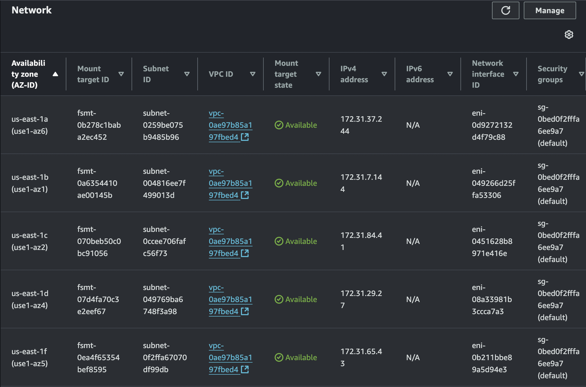

## Objective

In this post, I'll be following a different approach to what we've done before when studying [Amazon ECS](https://xycxz.github.io/ecs-aws/). Instead of pushing our image into an [Amazon ECR](https://xycxz.github.io/ecr-apprunner-aws/) repository and then using it to build our Task Definition, we will use Amazon EFS to host our application files and then mount them directly into a Task Definition.

In a production environment, the best way to upload our application to ECS is by using ECR. Our new approach here is a little bit less efficient, as files are being read over a `network mount`, which can introduce latency compared to files `baked into the container image`. However, this could still be useful when, for example, running a CMS (like WordPress) where multiple containers need to read/write the same filesystem.
## Amazon Elastic File System (EFS)

[Amazon Elastic File System (Amazon EFS)](https://docs.aws.amazon.com/efs/latest/ug/whatisefs.html) is a `scalable` file system solution. It provides a `shared network file system`, acting like a common hard drive that multiple ECS tasks can connect to at the same time, which is important to then easily `replicate` our containers. Because this creates a live, real-time link, any changes made to the files on EFS are `immediately reflected` across all running ECS containers.

One question could be: Why can't we use S3, for example? The reason is that we need a `fully-fledged file system solution` that integrates well into our OS where we can store the files. [Amazon S3](https://xycxz.github.io/s3-cloudfront-aws/) is more an object store, which means that we can store files there, but is not meant as a `file system` that we use. In addition, we can overwrite a file in S3, but what we would actually be doing is uploading a completely new version of it, which would not be optimal when using ECS.

We don't have to worry about storage limits in EFS because it can easily `scale`. When we create it, it is available `within the VPC` that we created it in (but could also be available to other VPCs).

To create an EFS volume, we can go to the dashboard and click on `Create file system`. Here we just need to specify a name for it and the VPC we want it to be:


**Note**: Of course, there are additional configurations we can do here by clicking on `Customize`. However, I'll keep the default configuration.

Because of our `network configuration`, we will notice that is not possible to access EFS from our computer to mount files:


## AWS Transfer Family

To upload our code to EFS, we will be using [AWS Transfer Family](https://docs.aws.amazon.com/transfer/latest/userguide/what-is-aws-transfer-family.html). For accessing EFS from our own computer, we need a way to `mount` it. We can't access it directly, as our own computer is `not within the VPC` of the EFS volume. 

We thus need to put a `server in between`, for managing access. We could use an EC2 instance where we would mount our EFS volume into or use a managed service like AWS Transfer Family.

`AWS Transfer Family` is a _managed service_ that allows us to access our EFS volume `from the outside`. It can expose a SFTP server for us which then `exposes` the EFS volume to us.

**Note**: Don't forget that AWS Transfer Family is quite [expensive](https://aws.amazon.com/aws-transfer-family/pricing/). So, be sure to turn this off when not needed anymore!

If we want to create a server for Transfer Family, we have to navigate to its dashboard and click on `Create server`. Here, we will choose the `SFTP` protocol and select `Service managed` (this means we can manage the `users` within the service).

When it comes to choosing an `endpoint`, the default selection is `Publicly accessible`, which can be a bit misleading. This is because, even though it is accessible from the internet, we won't be able to access the VPC in where EFS is running, thus failing to access EFS from our local computer.

That's why we need to choose the `VPC hosted` option and do a little bit of configuration there:


 
The yellow warning is telling us that we need an Elastic IP address to keep going with the configuration. We will allocate one and then assign it here. For that, we have to head to the VPC dashboard and then select `Elastic IPs -> Allocate Elastic IP address`:


When setting up the security groups, we need to make sure that this service can access the `internal VPC network` and can communicate with EFS and also the `external network` (internet) to communicate with our local machine. The default security group is the one we will use to communicate with EFS, but we will create a custom one to communicate with us:


**Note**: This configuration is not secure, because SSH should not be accessible from all IPv4s and IPv6s. I just do this for demonstration purposes, but you should only allow trusted IPs!


We must also choose Amazon EFS when selecting a domain. After that, we can leave the rest as default:


After creating the service, we will notice that it needs a `user` to connect to it. This is going to be the next step: configuring a user to access the service.


#### Creating a User

To create a user, we will click on `Add user`. We will set `User ID`, `Group ID`, and `Secondary group IDs` to 0 because we don't want to run into any issues with _Linux permissions_ (0 is the UID of the root user). When we click the 'info' link for the IAM role, it explains the requirements:

```
You will need to supply an IAM role when setting up your user to access files stored in your EFS file systems. The role determines what resources (EFS file system) you want to allow your user to access and which operations they can (and cannot perform). We recommend that you use the role for EFS file system selection and mount access with read/write permissions.

All roles used for the service must trust ‘transfer.amazonaws.com’.
```

I will be creating a new `role` for this here. For that, we need to head to the IAM dashboard and create a role with the following configuration:
###### Who can become this role? 

```json
{
	"Version": "2012-10-17",
	"Statement": [
		{
			"Sid": "Statement1",
			"Effect": "Allow",
			"Principal": {
			    "Service": "transfer.amazonaws.com"
			},
			"Action": "sts:AssumeRole"
		}
	]
}
```
###### Permissions

```json
{
    "Version": "2012-10-17",
    "Statement": [
        {
            "Effect": "Allow",
            "Action": [
                "elasticfilesystem:ClientMount",
                "elasticfilesystem:ClientRootAccess",
                "elasticfilesystem:ClientWrite",
                "elasticfilesystem:DescribeMountTargets"
            ],
            "Resource": "*"
        }
    ]
}
```

My final user configuration will look something like this:


After adding this user, we can start transferring files using the CLI and connecting to the Transfer Family endpoint:


Success! Now, we will see how to mount an EFS volume to access it `from within a task`.
#### Mounting EFS Volume

To mount an EFS volume we need to `update` the Task Definition, so that the task itself connects to the EFS volume. In addition, we need to mount this volume into the `container` so then we can access it. However, there are 2 steps that we need to be aware of:

1. It must be possible to access EFS from our ECS task and vice versa. EFS is a `network volume` so our ECS tasks must be able to `create this network connection`, which means that the security groups of EFS/ECS `must` allow this. To change the networking configuration in ECS, we will have to `create a new service` because the core networking configuration of an Amazon ECS service—including its VPC, subnets, and security groups—is `immutable`.

2. EFS must allow the access from a `permission level`. The IAM role/policy must allow this access to our EFS volume.

If we check the networking configuration of our EFS service, we will see the following security group:


The security group we see above accepts incoming traffic only from services that share the `same` security group. This is good for us because both ECS and EFS `share this security group`, allowing `connection` between them and, ultimately, enabling mounting files to our ECS from EFS.

This means that we just need to attach another security group that allows `HTTP traffic` from the internet. This way, we will be able to access the task our application is running on from the outside world:


**Note**: Remember: my [Web Server](https://xycxz.github.io/apache2-docker/) is configured to listen on port 8080.

Like I said before, the core networking configuration is _immutable_ when we talk about `services` in ECS. This is why we'll have to create a new one with the following networking rules:


This should be enough for ECS and EFS to be able to communicate with each other. Now we can simply define a new `revision` of our previous task and mount the files. The configuration should look similar to this:


**Note**: We need to click on `Advanced configurations` and check both boxes. `Transit encryption` enforces the use of TLS (between our ECS task and our EFS file system) to create a secure, encrypted tunnel for all data moving over the network. When we enable `IAM authorisation`, EFS will check the `IAM role` attached to our ECS task. It will only allow the connection if that specific role has an IAM policy explicitly granting it permission to `mount and interact with that file system`. This ensures that `only the intended application` can access the data, even if another task somehow ends up in the same network with permissive security group rules.


This configuration would make this volume available to mount in our container, but we're not mounting it just yet. For that, we need to specify a `mount point`:


Now, we can deploy this task revision by updating the service and force its deployment:


We can see that this works because this time we get a different error message. Since we did not mount our `db_connect.php` file, it is not able to find it. Good job!
## Next Steps

As a conclusion for today, I would encourage you to always explore as many options as you can when it comes to playing with Amazon AWS services. This is the only way to discover what is the most efficient and cheaper way to create our infrastructure.